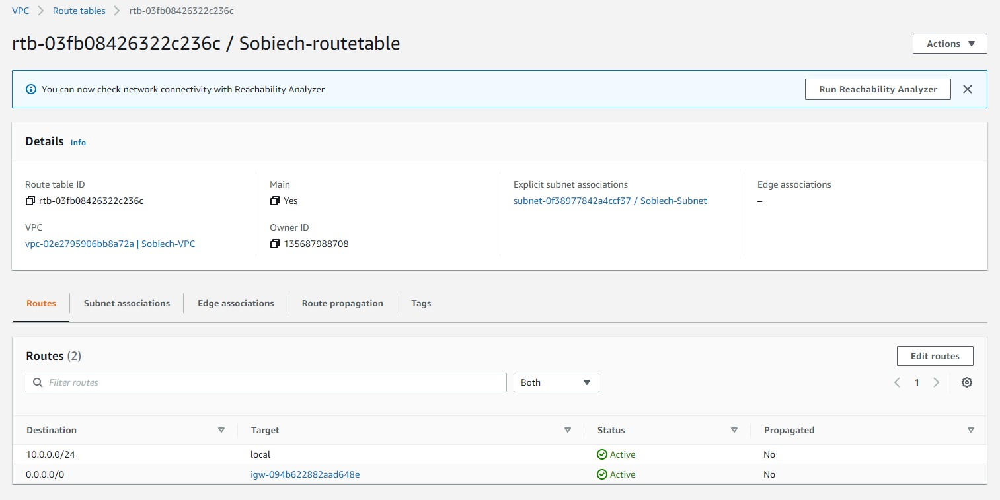

# Project 2 : CEG 3120
#### Name: Jacob Sobiech

---

### Part 1 - Building a VPC

* Create a VPC
  * The Virtual Private Cloud (VPC) is the cloud infrastructure that is reserved for the user (thus it is private) for them to add their systems to. It is the foundational piece that I will add a subnet, gateway and ultimately the virtual machine instance to.

* Create a subnet
  * A subnet is a subdivision of an IP network. The VPC hold subnets, and in turn the subnet holds and provides network infrastructure to the actual devices on the network such as an AWS virtual machine instance.

* Create an internet gateway
  * An internet gateway works as the access point to the wider world. It is the means by which a subnet can access the wider internet. It is attached to the VPC and it is used in route tables to establish internet connectivity.

* Create a route table
  * A route table provides the routes for the subnet and internet gateway to interact. It can tell specific traffic to go different places.
  * How to link internet gateway and routing table: https://docs.aws.amazon.com/vpc/latest/userguide/route-table-options.html#route-tables-internet-gateway

* Create a security group
  * Security groups can be assigned to VPCs and instances to define what kind of access is allowed. They can filter traffic and can bar or allow access to devices. In this case a security group is used to only allow ssh access to the AWS virtual machine instance from certain IP addresses.

### Part 2 - Launch an Instance

* Create a new instance:
  * AWS instance creation wizard - accessible under "Launch instance - walks through the steps of creating an instance.
  * AMI: Ubuntu Server 20.04, SSD Volume Type (64-bit x86)
    * default username: ubuntu
  * Instance type:
    * t2.micro (1 CPU, 1 GiB Memory)

* Attach instance to AWS
  * Under Step 3: Configure Instance Details go to Network and select your desired VPC (in this case the one tagged Sobiech-VPC).

* Determine whether an IPv4 address will be auto-assigned to the instance:
  * This can be selected on the same page as the last step under the option for Auto-assign Public IP. Since I will be attaching an elastic IP later, I left this setting on the default setting for the subnet which is to disable (do not connect a public IP).

* Attach a volume to your instance:
  * Default settings for the Ubuntu AMI were used here. They can be changed under the Step 4: Add Storage page. The default creates a 8 GiB volume with the Volume Type given as 'Root' and General Purpose SSD (gp2). It is stored as the device /dev/sda1 .

* Tag your instance with a "Name":
  * On Step 5: Add Tags add a tag. It will ask to add the tag as a key-value pair. I used "Name" as the key and "Sobiech-instance" as the value. It can be applied to instances, their volumes, and/or their network insterfaces. I left this as the default where the tag applies to all of them.

* Associate your security group:
  * On Step 6: Configure Security Group use the option to "Select an existing security group" and selectthe security group created in Part 1.

* Reserve an Elastic IP Address and associate it with your instance:
  * Back under the menus to create a VPC and other components related to it, go to the Elastic IPs tab. Create an elastic IP using the "Allocate Elastic IP" button in the top right. Under the actions tab, there is an option to associate and elastic IP with an instance. Use that.

* Change Hostname of AWS Instance:
  * ssh into instance with `ssh -i name-of-identity-file ubuntu@public-ip`
  * Change hostname with `sudo vim /etc/hostname`
  * Use `sudo reboot` then reconnect after waiting a minute for hostname change to take effect

